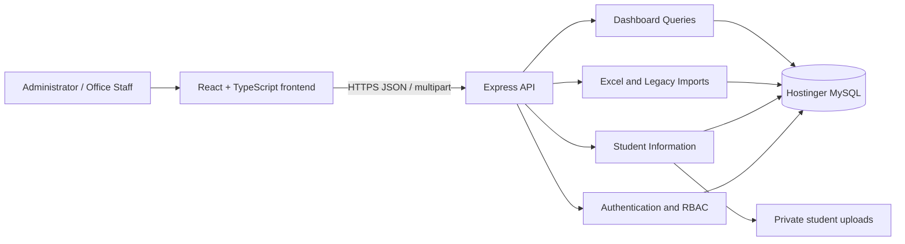
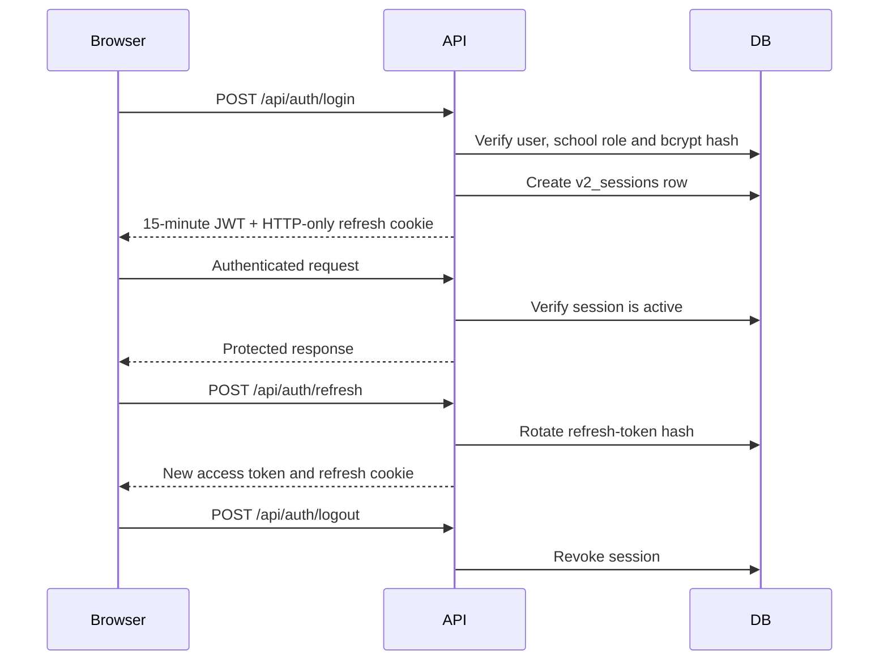

# Montessori Portal v2 — Complete Development Handbook

**Project location:** `E:\montessori-portal`  
**Document date:** 3 July 2026  
**Application type:** Multi-school student administration portal  
**Primary stack:** React, TypeScript, Express and Hostinger MySQL

---

## 1. Purpose of this document

This is the primary technical handbook for Montessori Portal v2. It explains:

- Why the application was rebuilt.
- What is implemented today.
- How the frontend, backend and database work.
- How to configure and run the project.
- How authentication, authorization and school isolation work.
- How students, imports and legacy migration work.
- How to build, test, deploy and operate the application.
- What remains to be developed.

Do not treat a screen or navigation item as complete merely because it is visible. The implementation-status section is the authoritative boundary.

---

## 2. Product objective

The portal will replace the legacy PHP administration application while preserving its data and business workflows.

Target workflow:

```text
Landing page
→ School selection
→ Secure login
→ Role-specific dashboard
→ Student administration
→ Admissions
→ Bulk import and migration
→ Certificates and transfer certificates
→ Fees and receipts
→ Events and reports
```

The legacy PHP application remains a business reference and temporary fallback. It must not receive new v2 development.

---

## 3. Architectural principles

1. **Clean rebuild:** Do not extend the legacy PHP architecture.
2. **Additive database changes:** Preserve all four legacy tables.
3. **Multi-school isolation:** Every operational request is scoped to the authenticated `school_id`.
4. **Backend authorization:** Frontend hiding is never considered security.
5. **Normalized student records:** Do not recreate the 42-column legacy table.
6. **Transactions:** Multi-table operations must commit or roll back together.
7. **Sensitive-data protection:** Aadhaar and bank values are encrypted and masked.
8. **Auditable operations:** High-risk changes create audit events.
9. **Modular monolith:** One deployable API with clear internal modules.
10. **Staged releases:** Legacy replacement occurs only after reconciliation and approval.

---

## 4. System architecture



### Runtime boundaries

- The frontend never connects directly to MySQL.
- The browser sends a short-lived JWT in the `Authorization` header.
- Refresh tokens are stored in an HTTP-only cookie.
- The API derives user, school and permissions from the authenticated session.
- School IDs supplied in request bodies are not trusted.

---

## 5. Technology stack

### Frontend

- React 19
- TypeScript
- Vite
- React Router
- Lucide icons
- Responsive custom CSS

### Backend

- Node.js
- Express 5
- TypeScript
- Zod validation
- MySQL2 connection pooling
- JOSE JWT handling
- bcrypt password hashing
- Multer file uploads
- ExcelJS workbook parsing
- Helmet, CORS and request rate limiting

### Database

- Existing Hostinger MySQL database
- Legacy tables retained
- New tables prefixed with `v2_`
- Ordered, checksummed SQL migrations

---

## 6. Repository structure

```text
montessori-portal/
├── backend/
│   ├── src/
│   │   ├── config/
│   │   │   └── env.ts
│   │   ├── database/
│   │   │   ├── migrate.ts
│   │   │   └── pool.ts
│   │   ├── modules/
│   │   │   ├── imports/
│   │   │   │   └── importService.ts
│   │   │   └── students/
│   │   │       └── studentRepository.ts
│   │   ├── security/
│   │   │   ├── fieldEncryption.ts
│   │   │   └── permissions.ts
│   │   ├── types/
│   │   │   └── auth.ts
│   │   ├── users/
│   │   │   ├── provisionAdmin.ts
│   │   │   └── resetPassword.ts
│   │   ├── data.ts
│   │   └── server.ts
│   ├── test/
│   │   ├── imports.test.ts
│   │   └── security.test.ts
│   ├── .env
│   ├── .env.example
│   ├── package.json
│   └── tsconfig.json
├── database/
│   ├── 001_v2_foundation.sql
│   ├── 002_student_information.sql
│   ├── 003_bootstrap_academics.sql
│   ├── 004_role_permissions.sql
│   ├── 005_sessions_student_lifecycle.sql
│   └── 006_import_workflow.sql
├── docs/
│   ├── COMPLETE_DEVELOPMENT_HANDBOOK.md
│   ├── IMPORT_WORKFLOW_RUNBOOK.md
│   ├── PRODUCTION_DATABASE_RUNBOOK.md
│   └── STUDENT_MODULE_IMPLEMENTATION.md
├── frontend/
│   ├── src/
│   │   ├── features/students/
│   │   │   └── StudentCreatePage.tsx
│   │   ├── api.ts
│   │   ├── App.tsx
│   │   ├── main.tsx
│   │   └── styles.css
│   ├── index.html
│   ├── package.json
│   ├── tsconfig.json
│   └── vite.config.ts
├── uploads/
│   └── students/
├── package.json
└── README.md
```

### Important source files

- `backend/src/server.ts`: API routes, authentication middleware and request validation.
- `backend/src/modules/students/studentRepository.ts`: production student/database operations.
- `backend/src/modules/imports/importService.ts`: workbook parsing, validation, staging and import approval.
- `backend/src/database/migrate.ts`: migration status, checksum, locking and application.
- `frontend/src/App.tsx`: application routes and main screens.
- `frontend/src/features/students/StudentCreatePage.tsx`: complete student intake form.
- `frontend/src/api.ts`: browser-to-API client.

---

## 7. Current implementation status

### Implemented and tested

- Responsive landing page.
- School selection.
- Database-backed administrator login.
- bcrypt password verification.
- Mandatory first-login password change.
- 15-minute access tokens.
- Seven-day rotating refresh sessions.
- Database session validation and logout revocation.
- Role and permission enforcement.
- School-scoped dashboard queries.
- Student list and search.
- Complete student intake form.
- Transactional student creation.
- Student profile.
- Basic student editing.
- Student status-history API.
- Guardian, identifier and audit-history display.
- Student photograph type/size validation.
- Aadhaar and bank-field encryption helpers.
- Academic year, board and class lookup.
- XLSX and CSV parsing.
- Legacy `student_details` staging.
- Import validation, duplicate detection and preview.
- Approval-controlled row imports.
- Downloadable CSV error report.
- Import audit events.
- Migration locking and checksum protection.
- Administrator provisioning and password-reset CLI tools.
- TypeScript production build.
- Six security/import unit tests.

### Implemented in code but awaiting database migration

Migration `006_import_workflow.sql` creates import batches, staging rows and import permissions. At the last verification attempt, Hostinger rejected the configured database credentials from the local public IP. Therefore:

- The import UI and API compile.
- Migration 006 is pending until connectivity is restored.
- Import endpoints will not work until migration 006 is applied.
- Users must sign out and log in again after migration to receive new import permissions.

### Partially implemented

- Student update currently covers core name, email, class, section and address.
- Student status is supported by API, but the profile UI needs a dedicated status-control panel.
- Student audit history is displayed in a basic timeline.
- Error reports export as CSV; styled XLSX error workbooks can be added later.
- Import approval is durable and transactional per student row, not one giant transaction for the entire batch.

### Planned, not complete

- Admissions enquiry, submission and approval.
- Student document-management interface and malware scanning.
- Soft-delete and restore UI.
- Certificates, TC approval and PDF generation.
- Fees, payments, receipts, reversals and reconciliation.
- Events and communication.
- Advanced reporting and exports.
- Attendance.
- Exams and report cards.
- Staff, timetable, transport, library and inventory.
- Production observability, automated deployment and backup monitoring.

---

## 8. Local development setup

### Requirements

- Windows, macOS or Linux
- Node.js 20 or later
- npm
- MySQL network access
- A staging database for migration testing

### Installation

```powershell
cd E:\montessori-portal
npm install
```

### Configure the backend

Copy `.env.example` to `.env` if necessary:

```powershell
Copy-Item backend\.env.example backend\.env
```

Never commit `.env`.

### Start the application

```powershell
cd E:\montessori-portal
npm run dev
```

Local services:

- Frontend: `http://localhost:5173`
- API: `http://localhost:4000`
- Health: `http://localhost:4000/api/health`

### Production build

```powershell
npm run build
```

### Tests

```powershell
npm test
```

---

## 9. Environment variables

| Variable | Purpose |
|---|---|
| `PORT` | API port, normally `4000` |
| `NODE_ENV` | `development`, `test` or `production` |
| `DEMO_MODE` | Must be `false` for database-backed operation |
| `JWT_SECRET` | JWT signing secret, minimum 32 characters |
| `DATA_ENCRYPTION_KEY` | Base64-encoded 32-byte AES key |
| `DB_HOST` | MySQL hostname |
| `DB_PORT` | MySQL port, usually `3306` |
| `DB_USER` | MySQL user |
| `DB_PASSWORD` | MySQL password |
| `DB_NAME` | Existing Montessori database |
| `DB_CONNECTION_LIMIT` | Maximum pool size |
| `DB_SSL` | Enables TLS for database connections |
| `FRONTEND_ORIGIN` | Allowed browser origin |
| `ALLOW_PRODUCTION_MIGRATIONS` | Temporary production migration unlock |

Generate an encryption key locally:

```powershell
[Convert]::ToBase64String(
  [Security.Cryptography.RandomNumberGenerator]::GetBytes(32)
)
```

Back up this key securely. Losing it makes encrypted fields unrecoverable.

---

## 10. Database strategy

### Legacy tables

The existing database contains:

- `SchoolName`
- `login`
- `api_tokens`
- `student_details`

Rules:

- Do not change or delete these tables during transition.
- Do not reuse legacy plaintext passwords.
- Do not reuse legacy API tokens.
- Treat `student_details` as read-only import source data.

### New table groups

#### Schools and users

- `v2_schools`
- `v2_users`
- `v2_user_school_roles`
- `v2_permissions`
- `v2_role_permissions`
- `v2_sessions`

#### Student records

- `v2_students`
- `v2_student_identifiers`
- `v2_guardians`
- `v2_student_guardians`
- `v2_student_addresses`
- `v2_admissions`
- `v2_student_leaving_records`
- `v2_student_status_history`

#### Academic setup

- `v2_academic_years`
- `v2_boards`
- `v2_classes`
- `v2_sections`

#### Audit and imports

- `v2_audit_events`
- `v2_import_batches`
- `v2_import_rows`
- `schema_migrations`

---

## 11. Migration system

### Commands

```powershell
cd E:\montessori-portal\backend
npm run migrate:status
npm run migrate:dry-run
npm run migrate:up
```

### Guarantees

- Migration filenames execute in sorted order.
- Applied checksums are stored.
- Modified applied migrations are rejected.
- MySQL advisory locking prevents concurrent migration runs.
- Status and dry-run are read-only.
- Production migration application is locked unless explicitly enabled.

### Migration inventory

| Migration | Purpose |
|---|---|
| `001` | Schools, users, roles, base students and audit foundation |
| `002` | Guardians, identifiers, addresses, admissions and leaving data |
| `003` | Schools, academic years, boards, classes and sections bootstrap |
| `004` | Permission definitions and role assignments |
| `005` | Database sessions and student lifecycle/status history |
| `006` | Import batches, staging rows and import permissions |

Never change an applied migration. Add a new numbered migration.

---

## 12. Authentication lifecycle



### First login

Provisioned users have `force_password_reset=1`. They are redirected to `/change-password`. Other routes reject the JWT until the password is changed.

### Administrator provisioning

```powershell
npm run user:provision-admin -- `
  --name "Administrator Name" `
  --email "admin@example.com" `
  --school-code MEMHSVNK
```

### Password reset

```powershell
npm run user:reset-password -- --email "admin@example.com"
```

Both commands print a one-time temporary password and store only its bcrypt hash.

---

## 13. Authorization and school isolation

Examples of permissions:

- `dashboard.view`
- `student.view`
- `student.create`
- `student.update`
- `student.status.change`
- `student.document.upload`
- `student.identifier.view_sensitive`
- `student.export`
- `academic.manage`
- `user.manage`
- `import.view`
- `import.upload`
- `import.approve`
- `import.legacy.stage`

Every protected route:

1. Verifies the JWT.
2. Verifies the database session.
3. Loads the authenticated school and permissions.
4. Enforces the required permission.
5. Uses `req.auth.schoolId` in database queries.

Never accept a request-body `schoolId` as the authorization boundary.

---

## 14. Student data model and workflow

### Form sections

1. Admission and academic placement
2. Student identity
3. Parents and guardians
4. Contact and residence
5. Leaving and transfer certificate

The form covers all meaningful legacy `student_details` fields and adds gender and section.

### Student creation transaction

```text
Validate request
→ Lock/check admission number
→ Verify academic year
→ Insert student
→ Insert identifiers
→ Encrypt Aadhaar
→ Insert guardians
→ Encrypt guardian Aadhaar and bank values
→ Insert address
→ Insert admission
→ Insert optional leaving record
→ Insert audit event
→ Commit
```

Any failure rolls back the transaction.

### Sensitive values

- AES-256-GCM is used for field encryption.
- Aadhaar and bank values store masked last-four representations.
- Sensitive values must never be logged.
- Sensitive reveal requires a dedicated permission.

---

## 15. Bulk import and legacy migration

### Accepted upload formats

- `.xlsx`
- `.csv`

Binary `.xls` is intentionally rejected until a maintained, secure parser is selected.

### Supported legacy headers

The parser recognizes headers including:

- `IDNo`
- `AdmissionNo`
- `NameOfThePupil`
- `StudentAadhaarNo`
- `PENNo`
- `AAPARID`
- Parent and guardian columns
- Address and contact columns
- Admission, class, leaving and TC columns
- `AcademicYear`
- `Board`

Header comparison ignores case, spaces and punctuation.

### Normalization

- Blank, `-`, `_`, `NULL` and `N/A` become missing values.
- Dates normalize to `yyyy-mm-dd`.
- Boards normalize to uppercase.
- Identifiers remain text.
- Required-field failures retain explicit errors.

### Import lifecycle

```mermaid
flowchart LR
    SOURCE["XLSX / CSV / legacy table"] --> PARSE["Parse and map headers"]
    PARSE --> VALIDATE["Normalize and validate"]
    VALIDATE --> STAGE["v2_import_rows staging"]
    STAGE --> REVIEW["Preview errors and duplicates"]
    REVIEW --> APPROVE["Permission-controlled approval"]
    APPROVE --> CREATE["Transactional student creation"]
    CREATE --> RECONCILE["Counts, audit and source traceability"]
```



Uploading never creates students directly. Only approved valid rows are imported.

### Import statuses

Batch:

- `validating`
- `ready`
- `approved`
- `importing`
- `completed`
- `completed_with_errors`
- `rejected`

Row:

- `valid`
- `error`
- `duplicate`
- `imported`

---

## 16. API reference

### Public and health

| Method | Route | Purpose |
|---|---|---|
| GET | `/api/health` | API and database health |
| GET | `/api/schools` | School selector |

### Authentication

| Method | Route | Purpose |
|---|---|---|
| POST | `/api/auth/login` | Login and create session |
| POST | `/api/auth/change-password` | Required first-login password change |
| POST | `/api/auth/refresh` | Rotate refresh token |
| POST | `/api/auth/logout` | Revoke session |

### Dashboard and academic setup

| Method | Route | Permission |
|---|---|---|
| GET | `/api/dashboard` | `dashboard.view` |
| GET | `/api/academic/setup` | `student.create` |

### Students

| Method | Route | Permission |
|---|---|---|
| GET | `/api/students` | `student.view` |
| POST | `/api/students` | `student.create` |
| GET | `/api/students/:id` | `student.view` |
| PUT | `/api/students/:id` | `student.update` |
| PATCH | `/api/students/:id/status` | `student.status.change` |

### Imports

| Method | Route | Permission |
|---|---|---|
| GET | `/api/imports` | `import.view` |
| GET | `/api/imports/:id` | `import.view` |
| POST | `/api/imports/upload` | `import.upload` |
| POST | `/api/imports/legacy/stage` | `import.legacy.stage` |
| POST | `/api/imports/:id/approve` | `import.approve` |
| GET | `/api/imports/:id/errors.csv` | `import.view` |

---

## 17. Frontend routes

| Route | Purpose |
|---|---|
| `/` | Landing |
| `/login` | School-scoped login |
| `/change-password` | Mandatory first-login password change |
| `/dashboard` | School dashboard |
| `/students` | Student directory |
| `/students/new` | Complete student intake |
| `/students/:id` | Student profile and editing |
| `/students/imports` | Import upload, staging and approval |
| `/admissions` | Placeholder |
| `/certificates` | Placeholder |
| `/fees` | Placeholder |
| `/reports` | Placeholder |

---

## 18. File uploads

### Student photographs

- JPEG, PNG and WebP
- Maximum 5 MB
- Random UUID filenames
- Invalid or failed student creations remove orphan uploads

### Import workbooks

- XLSX or CSV
- Maximum 15 MB
- Parsed in memory
- Original child data is not copied into source control

For production, replace local upload storage with private object storage and signed access URLs. Add malware scanning before document-management release.

---

## 19. Testing

Current automated tests cover:

- AES-256-GCM round trips.
- Encryption tamper detection.
- School-admin permission restrictions.
- Legacy spreadsheet normalization.
- Duplicate and Aadhaar validation.
- Placeholder-to-missing-value handling.

Run:

```powershell
npm test
```

Required future tests:

- Login, refresh rotation and revoked sessions.
- Forced password-change enforcement.
- Tenant-isolation attempts.
- Student transaction rollback.
- Import upload and approval integration.
- Duplicate races.
- File-size and MIME rejection.
- Status permissions.
- Migration on a fresh database.
- Browser tests for critical workflows.

---

## 20. Deployment

### Recommended topology

- Frontend: Vercel
- API: Hostinger Node.js application
- Database: Hostinger MySQL
- Files: private object storage
- Legacy PHP: retained during transition

### Frontend

- Root: `frontend`
- Build: `npm run build`
- Output: `dist`
- Configure API proxy/domain for production.

### Backend

- Root: `backend`
- Build: `npm run build`
- Start: `npm start`
- Load secrets through the host environment.
- Do not deploy `.env`.

### Release checklist

1. Confirm staging backup and restore.
2. Run tests and production build.
3. Run migration status and dry-run.
4. Verify exact database and pending filenames.
5. Apply already-tested migrations.
6. Restore migration lock.
7. Check `/api/health`.
8. Test login and one school-scoped query.
9. Monitor errors and database connections.
10. Keep legacy available until sign-off.

---

## 21. Current operational blocker

At the last check:

- Migrations `001` through `005` had been applied.
- Migration `006` was pending.
- Hostinger rejected the configured MySQL login with `ER_ACCESS_DENIED_ERROR`.
- API health returned `503`.
- The rejection referenced the local public IP used for remote MySQL access.

Resolution:

1. Verify the Hostinger database password.
2. Verify the effective `DB_USER`.
3. Allow the current public IP in Remote MySQL.
4. Restart the API.
5. Confirm `/api/health`.
6. Run status, dry-run and migration.
7. Sign out and log in again.

Do not repeatedly guess passwords or bypass the migration safety checks.

---

## 22. Development roadmap

### Phase A — Finish Student Information

- Complete guardian editing.
- Document upload and private storage.
- Status-control UI with reasons.
- Soft delete and restore.
- Advanced filters and pagination.
- Controlled exports.
- Full audit-history presentation.

### Phase B — Complete Migration

- Restore database access.
- Apply migration 006.
- Stage one school only.
- Review exceptions.
- Import a small approved batch.
- Reconcile source IDs and counts.
- Repeat school by school.

### Phase C — Admissions

- Application creation and numbering.
- Draft/submitted states.
- Principal approval.
- Rejection reason.
- Admission conversion.
- Documents and audit history.

### Phase D — Certificates and TC

- Request, review, approval and issue states.
- School-specific numbering.
- Existing certificate layout reproduction.
- PDF generation.
- Cancellation and reissue audit.

### Phase E — Fees

- Fee categories and structures.
- Student assignments.
- Collections and allocations.
- Receipts.
- Concessions, reversals and refunds.
- Daily collection and dues reports.

### Phase F — Events and reporting

- Events calendar.
- Notices and delivery tracking.
- Saved report filters.
- Controlled exports.
- Cross-school reporting for super administrators.

### Phase G — Later expansion

- Attendance.
- Exams and report cards.
- Staff and payroll.
- Timetable.
- Transport.
- Library.
- Inventory.

---

## 23. Definition of production readiness

The portal is ready to replace the legacy application only when:

- All required schools are configured.
- Fresh users and roles are provisioned.
- Tenant-isolation tests pass.
- Legacy records are reconciled by school.
- Student create/view/edit/status/document workflows pass.
- Certificate formats match approved samples.
- Fee transactions reconcile correctly.
- Backups and restores are proven.
- Sensitive fields are encrypted and access-audited.
- Monitoring and incident procedures exist.
- Client acceptance testing is signed off.
- Rollback to legacy is documented and tested.

---

## 24. Coding standards

- Use TypeScript strict mode.
- Validate all external inputs with Zod.
- Keep SQL parameterized.
- Never concatenate user values into SQL.
- Keep controllers thin and database work in modules/repositories.
- Use transactions for multi-table mutations.
- Return stable JSON error messages without secrets.
- Add a migration for schema changes.
- Add permission checks for new routes.
- Add audit events for high-risk operations.
- Add tests for every validation or security rule.
- Keep frontend loading, error and empty states explicit.

---

## 25. Daily developer workflow

```powershell
cd E:\montessori-portal

# Install after dependency changes
npm install

# Start both applications
npm run dev

# Before handing off work
npm test
npm run build

# Before database work
cd backend
npm run migrate:status
npm run migrate:dry-run
```

Never run `migrate:up` merely because a migration exists. Review it, test it on staging, verify a restore and confirm the target database first.

---

## 26. Related documents

- `docs/STUDENT_MODULE_IMPLEMENTATION.md`
- `docs/IMPORT_WORKFLOW_RUNBOOK.md`
- `docs/PRODUCTION_DATABASE_RUNBOOK.md`
- `README.md`

This handbook should be updated whenever routes, migrations, environment variables, module completion status or deployment procedures change.

